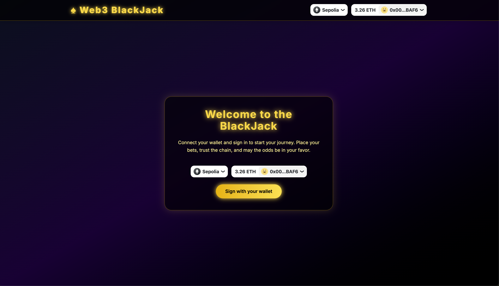
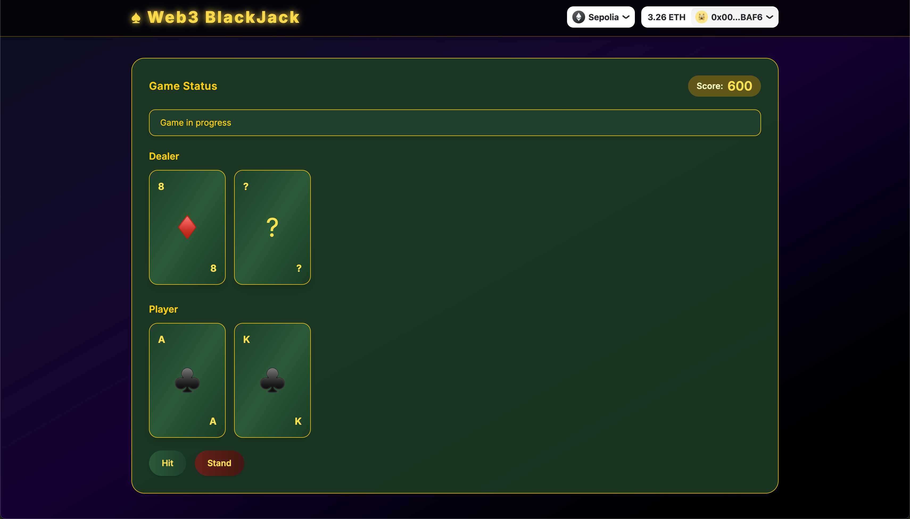
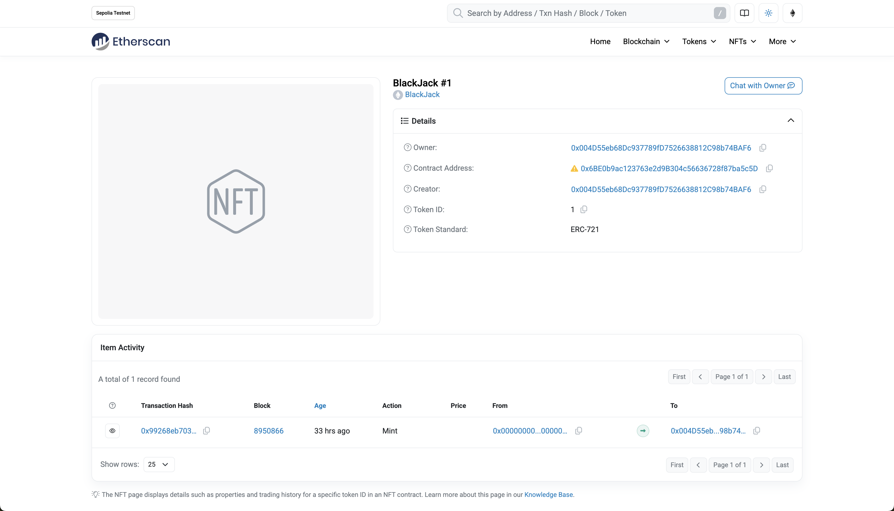

# BlackJack Web3 Game / Web3 二十一点游戏

[English](#english) | [中文](#中文)

---

<details>
<summary>📜 Table of Contents / 目录</summary>

- [English](#english)
  - [Overview](#overview)
  - [Features](#features)
  - [Tech Stack](#tech-stack)
  - [Screenshots](#screenshots)
  - [Installation](#installation)
  - [Environment Variables](#environment-variables)
  - [Usage](#usage)
  - [NFT Minting](#nft-minting)
  - [License](#license)
  - [Acknowledgements](#acknowledgements)
- [中文](#中文)
  - [概述](#概述)
  - [功能](#功能)
  - [技术栈](#技术栈)
  - [项目截图](#项目截图)
  - [安装](#安装)
  - [环境变量](#环境变量)
  - [使用方法](#使用方法)
  - [NFT 铸造](#nft-铸造)
  - [许可证](#许可证)
  - [致谢](#致谢)

</details>

## English

### Overview
A Web3-powered BlackJack game built with **React**, **Next.js**, **Wagmi**, **Viem**, **RainbowKit**, and **TailwindCSS**.  
Players connect their wallet on the **Sepolia** testnet, play BlackJack, and mint an NFT when reaching **1000 points**.

### Features
- 🎮 Play BlackJack directly in the browser
- 🔗 Wallet connection via RainbowKit
- ⚡ Built with modern Web3 stack: React + Next.js + Wagmi + Viem
- 🎨 Styled with TailwindCSS
- 🌐 Runs on the Sepolia test network
- 🏆 Mint an NFT after reaching 1000 points

### Tech Stack
- React
- Next.js
- Wagmi
- Viem
- RainbowKit
- TailwindCSS

### Screenshots
| Home Page | Gameplay | NFT Minting |
|-----------|----------|-------------|
|  |  |  |

### Installation
```bash
git clone https://github.com/iruochen/web3-blackjack.git
cd blackjack-web3
pnpm install
pnpm dev
```

### Environment Variables
Create `.env.local` in the project root and set:
```
NEXT_PUBLIC_WC_PROJECT_ID=
NEXT_TELEMETRY_DISABLED=1
AWS_USER_ACCESS_KEY_ID=
AWS_USER_ACCESS_KEY=
JWT_SECRET=
ETHEREUM_PROVIDER_SEPOLIA=
AWS_API_KEY=
EVM_PRIVATE_KEY=
NEXT_PUBLIC_CONTRACT_ADDRESS=
NEXT_PUBLIC_CONTRACT_ABI=
```

### Usage
1. Connect wallet (MetaMask or RainbowKit)
2. Switch to Sepolia network
3. Play BlackJack to earn points
4. Mint NFT when reaching 1000 points

### NFT Minting
- Minted via Sepolia smart contract
- Requires 1000 game points
- Executed through connected wallet transaction

### License
MIT License

### Acknowledgements
- [QingyangKong/blackjack-web3](https://github.com/QingyangKong/blackjack-web3)

---

## 中文

### 概述
基于 **React**、**Next.js**、**Wagmi**、**Viem**、**RainbowKit** 和 **TailwindCSS** 的 Web3 二十一点游戏。  
玩家可连接钱包到 **Sepolia** 测试网，玩二十一点并在达到 **1000 分**后铸造 NFT。

### 功能
- 🎮 浏览器中直接玩二十一点
- 🔗 使用 RainbowKit 连接钱包
- ⚡ 采用现代 Web3 技术栈：React + Next.js + Wagmi + Viem
- 🎨 使用 TailwindCSS 美化界面
- 🌐 运行于 Sepolia 测试网络
- 🏆 达到 1000 分后可铸造 NFT

### 技术栈
- React
- Next.js
- Wagmi
- Viem
- RainbowKit
- TailwindCSS

### 项目截图
| 首页 | 游戏中 | NFT 铸造 |
|------|--------|----------|
|  |  |  |

### 安装
```bash
git clone https://github.com/iruochen/web3-blackjack.git
cd blackjack-web3
pnpm install
pnpm dev
```

### 环境变量
在项目根目录新建 `.env.local` 并设置：
```
NEXT_PUBLIC_WC_PROJECT_ID=
NEXT_TELEMETRY_DISABLED=1
AWS_USER_ACCESS_KEY_ID=
AWS_USER_ACCESS_KEY=
JWT_SECRET=
ETHEREUM_PROVIDER_SEPOLIA=
AWS_API_KEY=
EVM_PRIVATE_KEY=
NEXT_PUBLIC_CONTRACT_ADDRESS=
NEXT_PUBLIC_CONTRACT_ABI=
```

### 使用方法
1. 连接钱包（MetaMask 或 RainbowKit）
2. 切换到 Sepolia 网络
3. 玩二十一点累积分数
4. 达到 1000 分点击铸造 NFT

### NFT 铸造
- 通过 Sepolia 智能合约铸造
- 需要 1000 分游戏积分
- 交易通过连接的钱包发起

### 许可证
MIT 许可证

### 致谢
- [QingyangKong/blackjack-web3](https://github.com/QingyangKong/blackjack-web3)
